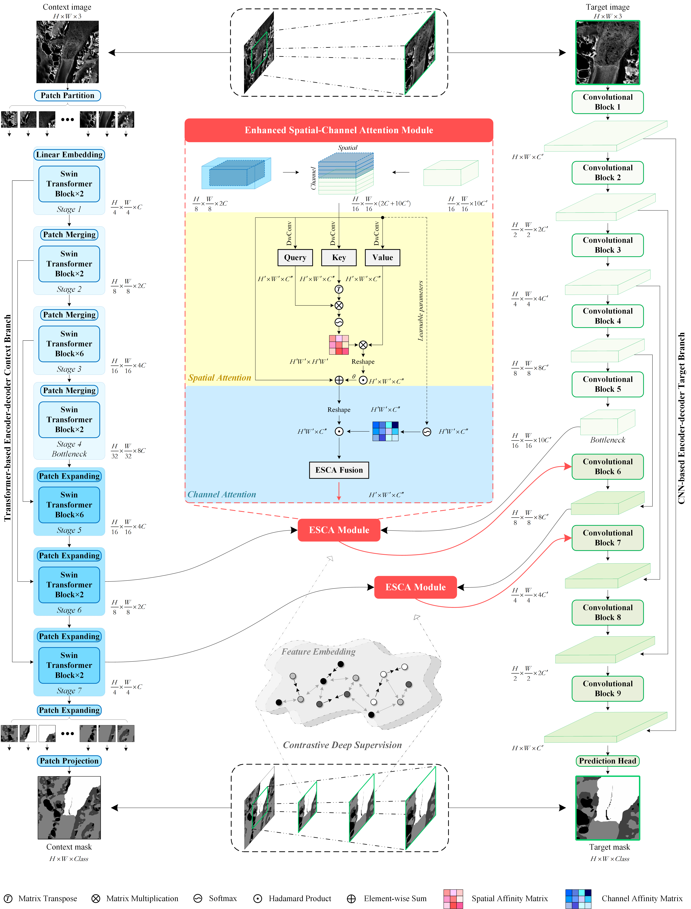

# AMD-HookNet++
This repository includes the codes for the paper:
 
[**AMD-HookNet++: Evolution of AMD-HookNet With Hybrid CNN–Transformer Feature Enhancement for Glacier Calving Front Segmentation**](https://ieeexplore.ieee.org/document/11296938), accepted by *IEEE TGRS*

$\texttt{Fei Wu, Marcel Dreier, Nora Gourmelon, Sebastian Wind, Jianlin Zhang, Thorsten Seehaus, Matthias Braun, Andreas Maier, and Vincent Christlein}$



### Abstract
The dynamics of glaciers and ice shelf fronts significantly impact the mass balance of ice sheets and coastal sea levels. To effectively monitor glacier conditions, it is crucial to consistently estimate positional shifts of glacier calving fronts. However, laborious manual mapping of calving fronts in satellite observations requires a considerable expense. The attention-multihooking-deep-supervision HookNet (AMD-HookNet) first introduces a pure two-branch convolutional neural network (CNN) for glacier segmentation. Yet, the local nature and translational invariance of convolution operations, while beneficial for capturing low-level details, restrict the model’s ability to maintain long-range dependencies. In this study, we propose AMD-HookNet++, a novel advanced hybrid CNN–Transformer feature enhancement method for segmenting glaciers and delineating calving fronts in synthetic aperture radar (SAR) images. Our hybrid structure consists of two branches: a Transformer-based low-resolution (context) branch to capture long-range dependencies, which provides global contextual information in a larger view, and a CNN-based high-resolution (target) branch to preserve local details. To strengthen the representation of the connected hybrid features, we devise an enhanced spatial–channel attention (ESCA) module to foster interactions between the hybrid CNN–Transformer branches through dynamically adjusting the token relationships from both spatial and channel perspectives. Additionally, we develop a pixel-to-pixel contrastive deep supervision for optimizing our hybrid model. It integrates pixelwise metric learning into glacier segmentation by guiding hierarchical pyramid-based pixel embeddings with category-discriminative capability. Through extensive experiments and comprehensive quantitative and qualitative analyses on the challenging glacier segmentation benchmark dataset CaFFe, we demonstrate that AMD-HookNet++ sets a new state of the art with an intersection over union (IoU) of 78.2 and a 95th percentile Hausdorff distance (HD95) of 1318 m, while maintaining a competitive mean distance error (MDE) of 367 m. More importantly, our hybrid model produces smoother delineations of calving fronts, resolving the issue of jagged edges typically seen in pure Transformer-based approaches.

### Preprocessing
Prepare train/validation/test datasets based on [CaFFe](https://github.com/Nora-Go/Calving_Fronts_and_Where_to_Find_Them), run center_crop.py, Sliding_window_generate_dataset.py, generate_target_context.py accordingly.

Download the official pretrained [Swin-Transformer](https://github.com/microsoft/Swin-Transformer) backbone model.

### Inference
Please refer to [CaFFe](https://github.com/Nora-Go/Calving_Fronts_and_Where_to_Find_Them) which offers a uniform standard postprocessing and analyzing tool for evaluating experimental results.

$\texttt{Upload an inference for calculating the Hausdorff distance (TODO)}$

### License
Licensed under an MIT license.

### Citation
If you find this work useful for your research, please cite us:
```bibtex
@ARTICLE{11296938,
  author={Wu, Fei and Dreier, Marcel and Gourmelon, Nora and Wind, Sebastian and Zhang, Jianlin and Seehaus, Thorsten and Braun, Matthias and Maier, Andreas and Christlein, Vincent},
  journal={IEEE Transactions on Geoscience and Remote Sensing}, 
  title={AMD-HookNet++: Evolution of AMD-HookNet With Hybrid CNN–Transformer Feature Enhancement for Glacier Calving Front Segmentation}, 
  year={2026},
  volume={64},
  number={},
  pages={1-22},
  keywords={Glaciers;Transformers;Convolutional neural networks;Benchmark testing;Spatial resolution;Radar polarimetry;Monitoring;Measurement;Remote sensing;Ice sheets;Hybrid CNN–Transformer;spatial–channel attention;contrastive deep supervision;semantic segmentation;glacier calving front segmentation},
  doi={10.1109/TGRS.2025.3642764}}

@Article{essd-14-4287-2022,
  AUTHOR = {Gourmelon, N. and Seehaus, T. and Braun, M. and Maier, A. and Christlein, V.},
  TITLE = {Calving fronts and where to find them: a benchmark dataset and methodology for automatic glacier calving front extraction from synthetic aperture radar imagery},
  JOURNAL = {Earth System Science Data},
  VOLUME = {14},
  YEAR = {2022},
  NUMBER = {9},
  PAGES = {4287--4313},
  URL = {https://essd.copernicus.org/articles/14/4287/2022/},
  DOI = {10.5194/essd-14-4287-2022}}
```

